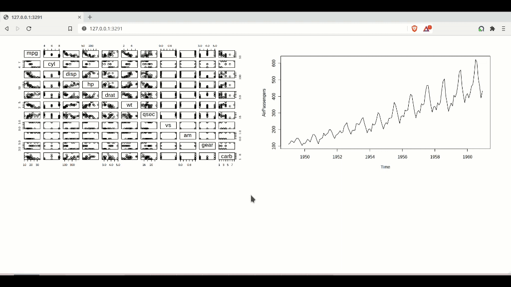
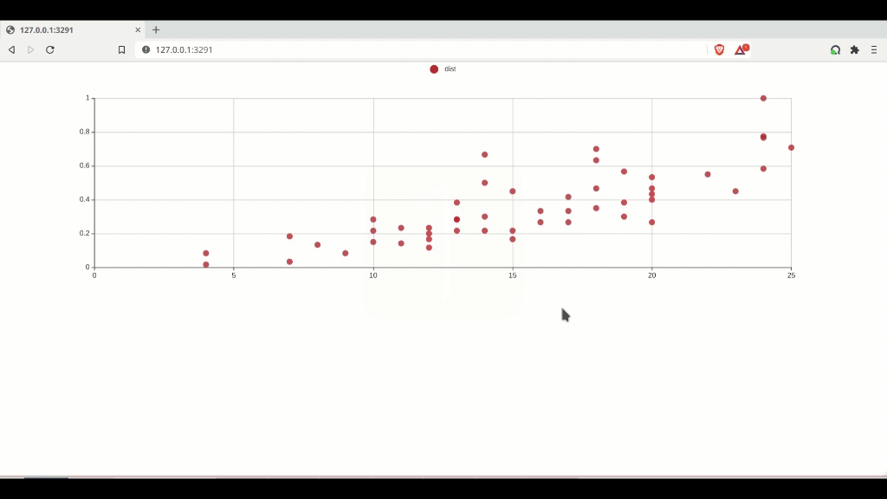

# shinyfullscreen

<!-- badges: start -->

[](https://codecov.io/github/etiennebacher/shinyfullscreen)

[](https://github.com/etiennebacher/shinyfullscreen/actions)
<!-- badges: end -->

The goal of `{shinyfullscreen}` is to enable users to put some items on fullscreen. This package is the adaptation in R of [`screenfull.js`](https://github.com/sindresorhus/screenfull.js).

## Table of contents

- [Demos](#demo)
- [Installation](#installation)
- [How to use](#howto)
- [Code of Conduct](#CoC)


<h2 id = "demo"> Demos </h2> 

* Two plots can be displayed on full screen



* Interactive graphs and custom background color on fullscreen only




<h2 id = "installation"> Installation </h2> 

For now, you can only install the development version with:

``` r
# install.packages("devtools")
devtools::install_github("etiennebacher/shinyfullscreen")
```

<h2 id = "howto"> How to use </h2> 

Note that `{shinyfullscreen}` only works when the Shiny app is launched **in the browser**. It won't work in an RStudio window. 

This package provides three functions that are very similar:

* `fullscreen_this()` is useful if you want to enable fullscreen for few elements. Simply wrap this function around the element for which you want to enable fullscreen, and then click on this element when the app runs to display it on fullscreen:

```R
### Only works in browser

library(shiny)
library(shinyfullscreen)

ui <- fluidPage(

  fullscreen_this(plotOutput("plot"))
  
  # Also works with magrittr's pipe
  # plotOutput("plot") %>%
  #   fullscreen_this()
)

server <- function(input, output, session) {
  
  output$plot <- renderPlot(plot(mtcars))
  
}

shinyApp(ui, server, options = list(launch.browser = TRUE))
```

* `fullscreen_those()` is useful if you want to enable fullscreen view for several items without rewriting the same code again and again. Simply write your UI as usual, and then call this function with a list of ids corresponding to the items for which you want to enable fullscreen view. Note that this function has to be called after having created these items:

```R
### Only works in browser

library(shiny)
library(shinyfullscreen)

ui <- fluidPage(
  plotOutput("plot"),
  plotOutput("plot2"),
  
  # Has to be placed after plot and plot2
  fullscreen_those(items = list("plot", "plot2"))
)

server <- function(input, output, session) {
  
  output$plot <- renderPlot(plot(mtcars))
  output$plot2 <- renderPlot(plot(AirPassengers))
  
}

shinyApp(ui, server, options = list(launch.browser = TRUE))
```

* `fullscreen_all()` allows you to put the whole page in fullscreen mode. Note however that this requires clicking on an HTML element.

```R
### Only works in browser

library(shiny)
library(shinyfullscreen)

ui <- fluidPage(
  actionButton("page_full", "Show page in fullscreen"),
  plotOutput("plot"),
  fullscreen_all(click_id = "page_full")
)

server <- function(input, output, session) {

  output$plot <- renderPlot(plot(mtcars))

}

shinyApp(ui, server, options = list(launch.browser = TRUE))
```

<h2 id = "CoC"> Code of Conduct </h2> 

Please note that the shinyfullscreen project is released with a [Contributor Code of Conduct](https://contributor-covenant.org/version/2/0/CODE_OF_CONDUCT.html). By contributing to this project, you agree to abide by its terms.
